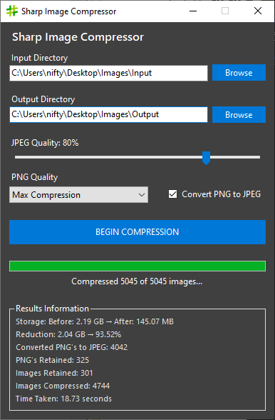

# SharpImageCompressorUI

**A simple  UI wrapper for efficient image compression using [ImageSharp](https://github.com/SixLabors/ImageSharp).**

## Features

- ✅ Specify JPEG and PNG compression levels  
- 🔄 Convert PNG images to JPEG (only when transparency is not present)  
- 🧼 Automatically retains PNGs with transparency to preserve alpha channel  
- 📉 Only saves compressed images if they are smaller than the original — otherwise, the original is copied to the output directory  

## Usage

1. Select the **Input Directory**
2. Select the **Output Directory**
3. Set the **JPEG Compression Quality** (optional; applies if JPEG conversion is enabled)
4. Set the **PNG Compression Level**
5. Click the **Compress** button

### Requirements

- .NET 6.0 or higher  

**Author:**  
NiftyPixel